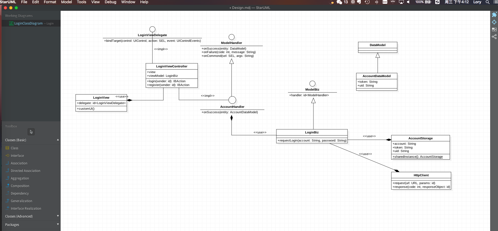
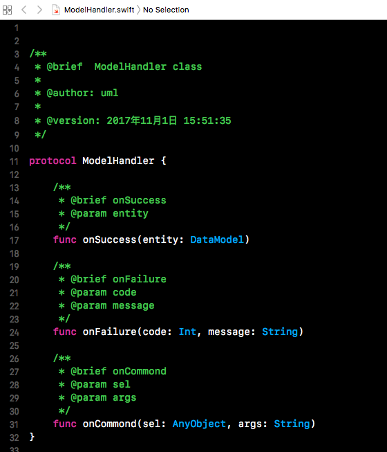
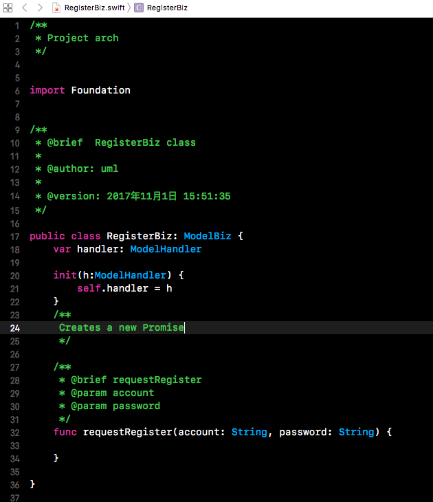

# staruml-starumlSwift
Swift Code Generator Extension for StarUML2

============================

This extension for StarUML(http://staruml.io) support to generate Swift(3.2+) code from UML model. Install this extension from Extension Manager of StarUML.

# Preview

